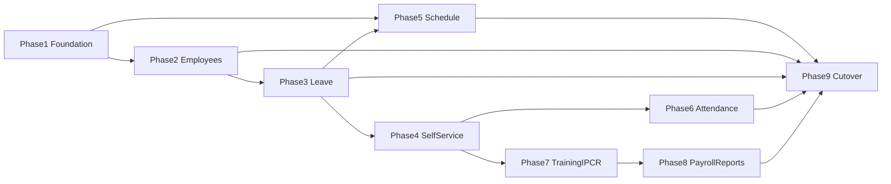

# HRIS & Schedule Integration — Phased Plan

Track work to grow this app into **HRIS & Payroll**, using:

- `reference projects/hris` — legacy people ops (read-only)
- `reference projects/schedulev2` — nursing Schedule Manager (read-only)

**Rules**

- Treat `reference projects/` as **read-only** (see `AGENTS.md`).
- Implement in this repository only.
- Check off items here so progress survives across chats and tools.

**Default data stance:** **Schema strategy B selected (2026-08-10).** Build normalized `hris_v2` and migrate employee records from legacy `tbl_*`. Preserve stable `**emp_id`**. Legacy `hris` remains available during dual-read. Own scheduling on `payroll_scheduler` and payroll ops on `payroll`. See `[docs/hris-foundation.md](hris-foundation.md)`.

**Schedule stance:** One Schedule module for all departments. Port schedulev2 capabilities as **optional department features**; never bypass approve → lock → DTR sync.

---

## Phase roadmap

| Phase | Name                         | Outcome                                             |
| ----- | ---------------------------- | --------------------------------------------------- |
| **1** | Foundation                   | Decisions, RBAC, nav, API hardening plan            |
| **2** | Employees                    | Employee master + PDS in this app                   |
| **3** | Leave                        | Filing, approvals, credits, leave reports           |
| **4** | Self-service + payslip       | Employee hub beyond time punch                      |
| **5** | Schedule for all departments | Generalize module; absorb schedulev2; Nursing pilot |
| **6** | Attendance bridges           | Biometrics / sync APIs secured                      |
| **7** | Training + performance       | TARF + IPCR                                         |
| **8** | Payroll & reports polish     | Medicare, consume API fate, leftover reports        |
| **9** | Cutover                      | Dual-run, retire legacy HRIS + schedulev2 usage     |

Optional parallel track under Phase 1: **schema modernization** (new HRIS DB + employee ETL). Do not block Phases 2–4 on it if you choose strategy A (UI on legacy `tbl_`*).

---

## Context (gap summary)

| Domain          | Legacy / schedulev2                 | This project today                     |
| --------------- | ----------------------------------- | -------------------------------------- |
| Employees / PDS | Full CRUD + print (hris)            | Mostly read API                        |
| Leave           | Apply / approve / credits (hris)    | Consume only                           |
| Training / IPCR | Full modules (hris)                 | Absent / read-only                     |
| Self-service    | Profile, leave, DTR, payslip (hris) | Time punch only                        |
| Scheduling      | Nursing-rich (schedulev2)           | Dept-generic + strong payroll DTR link |
| Payroll         | Consume + payslip viewer (hris)     | Generation engine (Medicare thin)      |
| Auth            | `user_level` / Jetstream+Spatie     | Spatie on HRIS accounts                |

---

## Phase 1 — Foundation

**Goal:** Agree ownership, permissions, and navigation before building modules.

- [x] Document legacy→new module map, data ownership (HRIS vs payroll vs scheduler), and cutover order — see `docs/hris-foundation.md`
- [x] **Decide schema strategy:** **(B)** new normalized HRIS schema + migrate existing employee records
- [x] If (B): design target employee model + ID policy (`emp_id` preserved + surrogate `id`)
- [x] If (B): plan ETL for `tbl_employee` + section tables (checksums / row counts) and dual-read period
- [x] Expand Spatie permissions/roles for employee, leave, training, IPCR, reports, self-service; map legacy `user_level` 1–4
- [x] Restructure app shell nav: Employees, Leave, Training, Performance, Self-Service + existing ops modules
- [x] Confirm Schedule strategy: enhance this module for all depts; schedulev2 is reference only
- [x] Define department **schedule profiles** (flags: `uses_units`, `uses_floaters`, `uses_on_call`, `uses_swaps`)
- [x] Plan API auth standard (Sanctum and/or API keys) for later biometric/schedule consumers

**Exit:** Strategy chosen; RBAC + nav scaffolding ready; schedule profile model agreed.

---

## Phase 2 — Employees

**Goal:** This app owns day-to-day employee master / PDS (on chosen schema).

- [x] ETL command `hris:migrate-employees` (`--dry-run` / `--apply`) for `tbl_employee` → `hris_v2`
- [x] Livewire employee directory (search / status) with legacy↔v2 switch via `HRIS_USE_V2`
- [x] Basic employee profile view (employment, contact, personal/gov IDs)
- [x] Core PDS edit (identity, contact, personal, gov IDs) on active source (legacy or v2)
- [x] Activate / deactivate (v2 stores separation date + reason)
- [x] Basic PDS print view (`/employees/{empId}/print`)
- [x] Full PDS section editors (family, education, eligibility, work, L&D, voluntary, other info, refs)
- [x] Dependents CRUD (included in PDS sections)
- [x] Section-table ETL (dependents + education + eligibility + work + training + volwork + other + refs)
- [x] File uploads (`employee_documents` on hris_v2 + profile UI)
- [x] Self-service PDS print/view (`/self-service/profile`)
- [x] User Accounts create/edit + reset/delete without breaking Spatie roles
- [x] Run employee ETL + validate; set `HRIS_USE_V2=true` after validation

**Exit:** HR can browse and edit core employee master + PDS sections here; v2 populated and optionally active.

---

## Phase 3 — Leave

**Goal:** Leave lifecycle lives here; schedule/payroll keep consuming the same leave data.

**Data choice (2026-08-10):** Phase 3 ships on **legacy** `hris` leave tables (`tbl_employee_leave`, `tbl_leave_log`, `tbl_leave_type`, `tbl_leave_status`, employee VL/SL columns) keyed by `emp_id`. No `hris_v2` leave tables yet — ETL for leave is deferred so payroll/schedule leave consumption is unchanged.

- [x] Apply / edit / cancel / print + leave card (`tbl_employee_leave` / logs; legacy tables)
- [x] Approval queue with Spatie roles (replace `user_level` checks)
- [x] Leave credits maintenance, undertime (via existing MRA/payroll adjustments), credit updater job (`hris:accrue-leave-credits`)
- [x] Hire-date / employment-status leave credit computation (`LeaveCreditComputationService`, `hris:compute-leave-credits`) + entitlements UI on Credits/Card; monthly accrual filtered by eligible empstat + hire date
- [x] Leave reports (monthly / type) under Leave app nav

**Exit:** Staff can file leave and approvers can act in this app; schedule availability still works.

---

## Phase 4 — Self-service + payslip

**Goal:** Employees use one hub instead of legacy menus.

- [ ] Self-service hub: My Profile, My Leave, My DTR, My Payslip (Time Punch already exists — open beyond super-admin as appropriate)
- [ ] Payslip index/print from stored payroll snapshots / runs
- [ ] Decide legacy `POST payroll/consume`: keep for external systems vs this app as payslip source

**Exit:** Typical employee no longer needs legacy HRIS for profile / leave / payslip / punch.

---

## Phase 5 — Schedule for all departments

**Goal:** One scheduler; nursing features optional; every dept can use the same product; payroll DTR path preserved.

### 5a — Core generalization

- [ ] Implement department schedule profile flags and gate UI accordingly
- [ ] Optional **schedule units** under `department_id` (ward/section/clinic/office)
- [ ] Scheduler scope via handled units (generalize schedulev2 `handled_locations`)
- [ ] My Schedule self-service for any employee with assignments
- [ ] Update Schedule User Manual (office vs clinical setup examples)

### 5b — Port from schedulev2 (flagged capabilities)

- [ ] Floater pool + temporary floater on assignments
- [ ] On-call / second on-call pools
- [ ] Duty census (headcount by day × shift)
- [ ] Shift swap workflow after approval
- [ ] Pattern-fill UX improvements where they beat current draft tools
- [ ] PDF/email distribution only if still required beyond current print settings
- [ ] Week/attendance API patterns if external consumers need them (secured)

### 5c — Pilots

- [ ] Pilot **Nursing** with full flags (units, floaters, on-call, swaps) + verify lock → DTR sync
- [ ] Pilot **one non-clinical department** with simple profile (units off; My Schedule ± swaps on)
- [ ] Roll out org-wide; stop dual-maintaining schedulev2

**Do not:** fork a second schedule DB, bypass lock→DTR, or copy hard-coded shift/dept IDs from schedulev2.

**Exit:** Nursing can retire schedulev2; other departments use the same module with a simpler profile.

---

## Phase 6 — Attendance bridges

**Goal:** Devices and satellite systems talk to this app securely.

- [ ] Port biometric punch API (`POST dtr/new`) with auth
- [ ] Port client/batch sync (`api/dtr/client/sync`) with auth
- [ ] Decide sub-HRIS replication: port, replace, or drop
- [ ] Fingerprint registration status + any manual DTR admin gaps vs DTR Encoding
- [ ] Lock down `/api/*` (Sanctum / API keys)

**Exit:** Clocks and sync clients no longer depend on legacy HRIS endpoints.

---

## Phase 7 — Training + performance

**Goal:** Remaining major HRIS modules.

- [ ] TARF / LDI (requests, approvals, calendar, reschedule, invites)
- [ ] TARF PDFs + uploaded training reports
- [ ] IPCR / OPCR / MFO (periods, targets, ratings, calibration, print)
- [ ] Self-service: My IPCR / My Training where applicable

**Exit:** Training and performance no longer require legacy HRIS.

---

## Phase 8 — Payroll & reports polish

**Goal:** Close gaps in the ops stack already centered here.

- [ ] Complete Medicare generation beyond `placeholderRows`
- [ ] Port remaining legacy reports still needed (DTR bulk print, statistics, appointment/PSS/exam if used)
- [ ] Final payslip/consume alignment from Phase 4 decision

**Exit:** Payroll/reporting parity for production use without legacy crutches.

---

## Phase 9 — Cutover

**Goal:** Dual-run then retire reference systems’ production use.

- [ ] Pilot one dept on Employees + Leave + Self-service against shared HRIS data; dual-run vs legacy HRIS
- [ ] Feature-flag / redirect traffic off legacy HRIS for completed modules
- [ ] Nursing (+ others) fully on Phase 5 Schedule; archive schedulev2 usage
- [ ] If schema (B): freeze legacy writes; decommission dual-read
- [ ] Update manuals; mark reference projects as historical only

**Exit:** This app is the operational HRIS & Payroll + Schedule system.

---

## Reference notes (non-todo)

### schedulev2 vs this Schedule module

|          | This app                                       | schedulev2                            |
| -------- | ---------------------------------------------- | ------------------------------------- |
| Purpose  | Dept-generic roster → **payroll DTR**          | Nursing Schedule Manager              |
| Scope    | `department_id` + rotation groups              | Locations + clinics + groups          |
| Workflow | draft → reviewed → approved → **locked** → DTR | P→S→C→R→A + PDF/email                 |
| Extras   | Conflict/staffing engine                       | Floaters, on-call, swaps, My Schedule |

### All-department capability matrix

| Capability                                | Default for all depts | Optional via profile |
| ----------------------------------------- | --------------------- | -------------------- |
| Grid, shifts, draft/approve/lock→DTR      | Yes                   | —                    |
| Rotations, templates, staffing, conflicts | Yes                   | —                    |
| My Schedule                               | Yes                   | —                    |
| Units / clinics                           | —                     | Yes                  |
| Floaters, on-call, swaps, census          | —                     | Yes                  |

---

## Progress log

| Date       | Notes                                                                                              |
| ---------- | -------------------------------------------------------------------------------------------------- |
| 2026-08-10 | Initial todo list from legacy vs payroll-api gap analysis.                                         |
| 2026-08-10 | Schema modernization track added.                                                                  |
| 2026-08-10 | schedulev2 applicability + all-department schedule generalization documented.                      |
| 2026-08-10 | Reorganized into Phases 1–9 (Foundation → Cutover).                                                |
| 2026-08-10 | Schema strategy **B** selected; Phase 1 foundation doc, RBAC, hris_v2 scaffold, schedule profiles. |
| 2026-08-10 | Phase 2 started: employee ETL command, directory + profile UI, nav wiring. |
| 2026-08-10 | Phase 2: core PDS edit, activate/deactivate, basic print view. |
| 2026-08-10 | Phase 2: PDS section tables/models, section CRUD UI, section ETL. |
| 2026-08-10 | Phase 2 complete: ETL validated, uploads, self-service profile, user reset/delete. |
| 2026-08-10 | PDS print rebuilt to CS Form 212 Revised 2026 (4-page layout). |
| 2026-08-10 | Phase 3 Leave: requests/approvals/credits/card/reports + My Leave on legacy leave tables; nav wired; `hris:accrue-leave-credits`. |
| 2026-08-10 | Leave credits: compute from `date_hired` + `empstat_id` (legacy rules), `hris:compute-leave-credits`, entitlements on Credits/Card, smarter monthly accrual. |
| 2026-08-10 | PDS section editors: exposed missing DB fields (extension, employer/company address, urls, L&D type_id) and CS Form-aligned list columns. Intentional gaps: no separate voluntary org address or reference email columns in legacy/v2 (address/email can be typed into name/contact fields). |
| 2026-08-10 | PDS parity audit: fixed other-info type 0/1/2→skill/recognition/membership, work-status labels, is_government Y/N ETL bug; education/status selects; profile height/weight/citizenship/religion/gov issued ID + CS Form Qs; data repair migration. |

