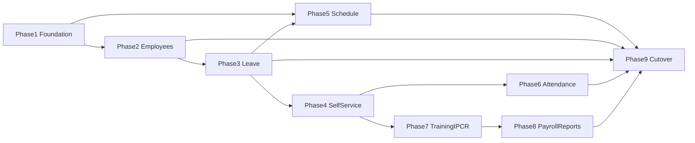

# HRIS & Schedule Integration — Phased Plan

Track work to grow this app into **HRIS & Payroll**, using:

- `reference projects/hris` — legacy people ops (read-only)
- `reference projects/schedulev2` — NDOS (Nursing Division Online Scheduling) reference codebase (read-only)

**Rules**

- Treat `reference projects/` as **read-only** (see `AGENTS.md`).
- Implement in this repository only.
- Check off items here so progress survives across chats and tools.

**Default data stance:** **Schema strategy A (updated 2026-08-12).** People master / PDS / leave / TARF / IPCR stay on legacy `hris` (`tbl_*`). Parallel `hris_v2` + ETL + cutover flags were removed. In-place schema ideas: [`docs/hris-schema-enhancements.md`](hris-schema-enhancements.md). Own scheduling on `payroll_scheduler` and payroll ops on `payroll`. See [`docs/hris-foundation.md`](hris-foundation.md).

**Schedule stance:** One Schedule module for all departments. Port NDOS capabilities as **optional department features**; never bypass approve → lock → DTR sync.

---

## Phase roadmap


| Phase | Name                         | Outcome                                             |
| ----- | ---------------------------- | --------------------------------------------------- |
| **1** | Foundation                   | Decisions, RBAC, nav, API hardening plan            |
| **2** | Employees                    | Employee master + PDS in this app                   |
| **3** | Leave                        | Filing, approvals, credits, leave reports           |
| **4** | Self-service + payslip       | Employee hub beyond time punch                      |
| **5** | Schedule for all departments | Generalize module; absorb NDOS; Nursing pilot |
| **6** | Attendance bridges           | Biometrics / sync APIs secured                      |
| **7** | Training + performance       | TARF + IPCR                                         |
| **8** | Payroll & reports polish     | Medicare, consume API fate, leftover reports        |
| **9** | Cutover                      | Dual-run, retire legacy HRIS + NDOS usage     |


Optional parallel track under Phase 1: ~~schema modernization (new HRIS DB + employee ETL)~~ **cancelled** — stay on legacy `tbl_*`; backlog in `docs/hris-schema-enhancements.md`.




---

## Context (gap summary)


| Domain          | Legacy / NDOS                       | This project today                     |
| --------------- | ----------------------------------- | -------------------------------------- |
| Employees / PDS | Full CRUD + print (hris)            | Mostly read API                        |
| Leave           | Apply / approve / credits (hris)    | Consume only                           |
| Training / IPCR | Full modules (hris)                 | Phase 7 vertical slice on legacy `hris` TARF/`ipcr_*` tables |
| Self-service    | Profile, leave, DTR, payslip (hris) | Profile, leave, DTR, payslip, Time Punch |
| Scheduling      | Nursing-rich (NDOS)                 | Dept-generic + strong payroll DTR link |
| Payroll         | Consume + payslip viewer (hris)     | Generation + Medicare compute; History/My Payslip from snapshots; consume stays on legacy |
| Auth            | `user_level` / Jetstream+Spatie     | Spatie on HRIS accounts                |


---

## Phase 1 — Foundation

**Goal:** Agree ownership, permissions, and navigation before building modules.

- [x] Document legacy→new module map, data ownership (HRIS vs payroll vs scheduler), and cutover order — see `docs/hris-foundation.md`
- [x] **Decide schema strategy:** **(B)** new normalized HRIS schema + migrate existing employee records
- [x] If (B): design target employee model + ID policy (`emp_id` preserved + surrogate `id`)
- [x] If (B): plan ETL for `tbl_employee` + section tables (checksums / row counts) and dual-read period
- [x] Expand Spatie permissions/roles for employee, leave, training, IPCR, reports, self-service; map legacy `user_level` 1–4
- [x] Restructure app shell nav: Employees, Leave, Training, Performance, Self-Service + existing ops modules
- [x] Confirm Schedule strategy: enhance this module for all depts; NDOS is reference only
- [x] Define department **schedule profiles** (flags: `uses_units`, `uses_floaters`, `uses_on_call`, `uses_swaps`)
- [x] Plan API auth standard (Sanctum and/or API keys) for later biometric/schedule consumers

**Exit:** Strategy chosen; RBAC + nav scaffolding ready; schedule profile model agreed.

---

## Phase 2 — Employees

**Goal:** This app owns day-to-day employee master / PDS on legacy `hris`.

- [x] ~~ETL command `hris:migrate-employees`~~ **cancelled 2026-08-12** (no `hris_v2`)
- [x] Livewire employee directory (search / status) on legacy `tbl_employee`
- [x] Basic employee profile view (employment, contact, personal/gov IDs)
- [x] **Employee View 360° hub** (`/employees/{empId}?tab=`): summary strip + permission-gated tabs for profile/PDS/docs (editable) and read-only Leave / TARF / IPCR / DTR / Schedule / Payroll / Account panels with deep links
- [x] **Employment / plantilla history** (`employee_employment_history` + Employment tab): original/promotion/transfer trail with plantilla item no.; seeds from current master; recording a change updates `tbl_employee` cache
- [x] Core PDS edit (identity, contact, personal, gov IDs) on legacy
- [x] **Create employee** (`/employees/create`) + optional login account (Employee role, temp password, `login_attempt=0`)
- [x] Activate / deactivate
- [x] Basic PDS print view (`/employees/{empId}/print`)
- [x] Full PDS section editors (family, education, eligibility, work, L&D, voluntary, other info, refs)
- [x] Dependents CRUD (included in PDS sections)
- [x] ~~Section-table ETL~~ **cancelled 2026-08-12**
- [x] File uploads (`employee_documents` on `hris` + profile UI)
- [x] Self-service PDS print/view (`/self-service/profile`) + first-login / annual profile update gate (`login_attempt`)
- [x] User Accounts create/edit + reset/delete without breaking Spatie roles
- [x] ~~Run employee ETL + `HRIS_USE_V2=true`~~ **cancelled 2026-08-12** — strategy A

**Exit:** HR can browse and edit core employee master + PDS sections here against legacy `hris`.

---

## Phase 3 — Leave

**Goal:** Leave lifecycle lives here; schedule/payroll keep consuming the same leave data.

**Data choice (2026-08-10):** Phase 3 ships on **legacy** `hris` leave tables (`tbl_employee_leave`, `tbl_leave_log`, `tbl_leave_type`, `tbl_leave_status`, employee VL/SL columns) keyed by `emp_id`.

- [x] Apply / edit / cancel / print + leave card (`tbl_employee_leave` / logs; legacy tables)
- [x] Itemized leave dates (`remarks` CSV + `LeaveDates`); pick/weekdays/calendar modes; LWOP auto-split + leave log action 7; `applicant_note` for free text; VL/SL deduct on apply
- [x] **Leave credit ledger** (additive): `employee_leave_credit_ledger` written alongside legacy VL/SL columns + `tbl_leave_log`; Leave Credits drawer + Employee hub Leave tab; seed `hris:seed-leave-credit-ledger`
- [x] Approval queue with Spatie roles (replace `user_level` checks)
- [x] Leave credits maintenance, undertime (via existing MRA/payroll adjustments), credit updater job (`hris:accrue-leave-credits`)
- [x] Hire-date / employment-status leave credit computation (`LeaveCreditComputationService`, `hris:compute-leave-credits`) + entitlements UI on Credits/Card; monthly accrual filtered by eligible empstat + hire date
- [x] Leave reports (monthly / type) under Leave app nav

**Exit:** Staff can file leave and approvers can act in this app; schedule availability still works.

---

## Phase 4 — Self-service + payslip

**Goal:** Employees use one hub instead of legacy menus.

- [x] Self-service hub: My Profile, My Leave, My DTR, My Payslip (Time Punch already exists — open beyond super-admin as appropriate)
  - Nav: Profile → Leave → DTR → Payslip → Time Punch → My Schedule (Phase 5a).
  - Time Punch gated by `self-service.dtr|self-service.access` (not super-admin-only).
  - My Schedule gated by `self-service.schedule|self-service.access`.
- [x] Payslip index/print from stored payroll snapshots / runs
  - Source: `payroll_batch_records.snapshot_json` (+ batch period/type); routes `/self-service/payslip` + print.
- [x] Decide legacy `POST payroll/consume`: keep for external systems vs this app as payslip source
  - **Decision (2026-08-11):** Keep legacy `POST payroll/consume` for external/legacy consumers if still deployed there. This app is the **employee payslip UI** source from local `payroll_batches` / `payroll_batch_records` snapshots. No consume endpoint exists in this repo today — do not delete or port blindly. **Phase 8 finalized** this stance in `docs/hris-foundation.md` and added admin History payslip print.

**Exit:** Typical employee no longer needs legacy HRIS for profile / leave / payslip / punch.

---

## Phase 5 — Schedule for all departments

**Goal:** One scheduler; nursing features optional; every dept can use the same product; payroll DTR path preserved.

### 5a — Core generalization

- [x] Implement department schedule profile flags and gate UI accordingly
- [x] Optional **schedule units** under `department_id` (ward/section/clinic/office)
- [x] Scheduler scope via handled units (generalize NDOS `handled_locations`)
- [x] My Schedule self-service for any employee with assignments
- [x] Update Schedule User Manual (office vs clinical setup examples)

**5a notes (2026-08-11):** Profile UI at `/schedule/department-profile`; Units CRUD + `schedule_user_units` handled scope at `/schedule/units` (requires `uses_units`); assignment `unit_id` nullable on dashboard (does not change lock→DTR); My Schedule at `/self-service/schedule` (`self-service.schedule`). **Deferred / light:** auto-assign unit on draft generation from employee default unit; employee-settings `default_unit_id` column exists but UI not wired yet.

### 5b — Port from NDOS (flagged capabilities)

- [x] Floater pool + temporary floater on assignments
- [x] On-call / second on-call pools
- [x] Duty census (headcount by day × shift)
- [x] Shift swap workflow after approval
- [x] CNO / Nursing mode (`schedule.cno_division_id`, default 3) — nursing profile defaults + division-aware sync/UX
- [x] Pattern-fill UX improvements where they beat current draft tools
- [x] PDF/email distribution only if still required beyond current print settings
- [x] Week/attendance API patterns if external consumers need them (secured)

**5b notes (2026-08-11):** Flag-gated UIs wired (SOON badges removed): Floaters `/schedule/floaters`, On Call `/schedule/on-call`, Duty Census `/schedule/census`, Shift Swaps `/schedule/swaps` + self-service `/self-service/swaps` when `uses_swaps`. Dashboard “Float” checkbox when `uses_floaters`. Migration `2026_08_11_110000_create_schedule_phase5b_and_sync_tables.php`.

**Pattern fill / PDF-email / week API (2026-08-11):** Dashboard **Pattern fill** panel — select employees (checkboxes), date range, template/rotation pattern; **Preview** then **Apply** (locked months blocked). Row “Preview pattern…” loads selection into the panel. PDF download `/schedule/{id}/pdf` + Print Settings **PDF / email distribution** (`#distribution`): optional unit filter, extra emails and/or handled-unit supervisors; queueable `ScheduleDistributionMail` (regenerates PDF in worker). Mail gated by real `MAIL_FROM_ADDRESS` (not `hello@example.com`) via `ScheduleMailConfig`. Secured APIs: `GET /api/schedule/week` and `GET /api/schedule/attendance` (attendance = approved/locked assignments only, not DTR) under `api.access` (device key / Sanctum / session).

**CNO vs other divisions (2026-08-11):** `config/schedule.php` → `cno_division_id` (env `SCHEDULE_CNO_DIVISION_ID`, default **3** = HRIS “Nursing Service”). Departments in that division auto-provision `ScheduleDepartmentProfile` with nursing flags on (`uses_units`, `uses_floaters`, `uses_on_call`, `uses_swaps`, `uses_census`) via first visit (`ensureForDepartment`) or `php artisan schedule:provision-department-profiles --apply` / `ScheduleDepartmentProfileSeeder`. Other divisions keep **simple** defaults; enable **`uses_units` only** for multi-area offices (UI labels “Areas”). Nav/dashboard show mode badge; Units nav label becomes Areas for non-CNO. Sync: `--division=3` keeps rows when HRIS home dept, duty-location-resolved dept, or NDOS `location.division_id` is in that division; CNO location name resolution prefers CNO HRIS departments. Migration `2026_08_11_120000_add_division_id_to_schedulev2_sync_runs_table.php`.

**NDOS sync (added with 5b; connection/command ids remain `schedulev2`):** UI at **Schedule → Import / Pull (NDOS)** (`/schedule/schedulev2-sync`; Dashboard toolbar **Pull from NDOS**). Requires `schedule.manage` for dry-run/apply (`schedule.view` can open the page). Also `php artisan schedule:sync-schedulev2 --dry-run|--apply` with `--from=`/`--to=` or `--months-back=`/`--months-ahead=`, optional `--department=`/`--division=`/`--emp=`/`--limit=`. Connection `schedulev2` via `DB_*_SCHEDULEV2` (see `.env.example` + `config/schedule.php`). Maps `employee_schedules` → `schedule_assignments` by `emp_id` (idempotent via `legacy_emp_sched_id` + unique monthly/emp/date). **Only approved source rows** (`employee_schedules.status = A`; NDOS codes: P pending, S submitted, C checked, R recommended, A approved, D deleted — P/S/C/R/D excluded at fetch). **Every run re-compares** mapped rows and **updates in place** when shift/unit/emp/date/label/notes changed; identical rows count as `unchanged` (not “skip existing”). Counters: create / update / unchanged / skip(reasons). **Department placement** prefers duty location → local dept (`locations.department_id` if present, else location name → HRIS `tbl_department` / existing `ScheduleUnit`, with CNO preference when `location.division_id` matches CNO), then falls back to HRIS home `department_id`. `--department=` matches **either** HRIS home **or** duty-location-resolved dept (floaters into that location included). `--division=` matches home dept, resolved dept, or location division. Approved imports land under **locked** months without calling `ScheduleLockService` / DTR. If a previously imported source row is later un-approved or deleted, sync **leaves local locked assignments alone** (no auto-delete — avoids payroll DTR side effects). OC shift labels skipped by config.

**NDOS full backfill (2026-08-11):** Destructive reference import via `php artisan schedule:backfill-schedulev2` (`Schedulev2BackfillService`) and Import page **Full backfill (destructive)** (type `BACKFILL`). Default `--dry-run`; apply requires `--apply --force`. **Clears only schedule-owned** `payroll_scheduler` tables (assignments, swaps, monthly schedules, template days/templates, staffing_requirements, rotation members/groups, user units, employee schedule settings, units, shift codes, floater/on-call pools, legacy maps, sync runs, audit logs, signatories, department profiles). **Never clears** HRIS/payroll, `employee_references`, print settings/logos, roles, cache, jobs, migrations. Backfill order: shifts→shift codes; locations+clinics→units; groups→rotation groups + members; employee_locations→settings (+ floater pool); handled_locations→schedule_user_units; employee_floaters→monthly floaters; on_calls/second_on_calls→on-call pools; signatories; re-provision CNO department profiles. NDOS has **no patterns/templates** — local templates stay empty after clear. Optional `--with-assignments` then runs approved-only assignment sync (locked months, **no DTR**). Maps written to `schedulev2_legacy_maps`. **Hardening:** rotation group names include `#{groups.id}` so duplicate NDOS group_name under the same location/dept cannot hit `rotation_groups_department_name_unique`; per-row errors are skipped and later phases still run (no wrapping transaction rollback); unmatched locations use fuzzy/CNO heuristics or `SCHEDULEV2_BACKFILL_FALLBACK_DEPARTMENT_ID` / `SCHEDULEV2_BACKFILL_UNMATCHED_TO_CNO`.

### 5c — Pilots

- [ ] Pilot **Nursing** with full flags (units, floaters, on-call, swaps) + verify lock → DTR sync
  - **Prep done:** CNO division defaults + `--division=3` sync filter + user manual. Still need live pilot: provision profiles, sync a month, approve→lock→DTR on one nursing ward/dept, compare to NDOS.
- [ ] Pilot **one non-clinical department** with simple profile (units off; My Schedule ± swaps on)
  - **Prep done:** simple defaults documented; multi-area via `uses_units` only. Still need pick a non-CNO dept and run a month end-to-end.
- [ ] Roll out org-wide; stop dual-maintaining NDOS

**5c pilot checklist (do not mark complete without live evidence):**

1. Pick pilot department (Nursing ward under CNO division_id=3, or one non-CNO office).
2. `php artisan schedule:provision-department-profiles --apply` (or open Department Profile once) and confirm flags.
3. Optional full refs: `php artisan schedule:backfill-schedulev2 --dry-run` then `--apply --force` (add `--with-assignments --division=3` for a month range, or sync separately).
4. Optional assignment-only: `php artisan schedule:sync-schedulev2 --dry-run --division=3` then `--apply` for a target month (imports as locked without auto DTR).
5. In this app: draft → review → approve → **lock** for the same month/dept; confirm `ScheduleLockService` wrote payroll DTR encodings.
6. Spot-check DTR Encoding / My Schedule vs NDOS (or prior month) for emp_id coverage and shift labels.
7. Only then tick the pilot boxes and plan dual-run cutover.

**Do not:** fork a second schedule DB, bypass lock→DTR, or copy hard-coded shift/dept IDs from NDOS.

**Exit:** Nursing can retire NDOS; other departments use the same module with a simpler profile.

---

## Phase 6 — Attendance bridges

**Goal:** Devices and satellite systems talk to this app securely.

- [x] Port biometric punch API (`POST dtr/new`) with auth
  - `POST /api/dtr/new` + legacy-compatible `POST /dtr/new` (CSRF exempt). Device key required. Writes `hris.tbl_employee_dtr` via `BiometricPunchService` (sync; legacy response shape).
- [x] Port client/batch sync (`api/dtr/client/sync`) with auth
  - `POST /api/dtr/client/sync` with `api.device` middleware; idempotent upsert by `emp_id` + `attendance_date`.
- [x] Decide sub-HRIS replication: port, replace, or drop
  - **Decision (2026-08-11): drop/replace.** Do not port `POST api/sub-hris/dtr/sync` / `ReplicateToSubHRIS`. Satellites should call this app’s secured punch/sync APIs (or read shared HRIS DB during dual-run). Revisit only if a live dependency is proven.
- [x] Fingerprint registration status + any manual DTR admin gaps vs DTR Encoding
  - Read-only Timekeeping page `/payroll/fingerprint-registration` (`timekeeping.view`). Notes gap: no raw punch CRUD like legacy admin; use corrections + device APIs; enrollment UI not ported.
- [x] Lock down `/api/*` (Sanctum / API keys)
  - `api.access` on API group when `API_REQUIRE_AUTH=true`; device keys always required on punch/sync. See `config/api.php` + `docs/hris-foundation.md`.

**Exit:** Clocks and sync clients no longer depend on legacy HRIS endpoints (point them here with `API_DEVICE_KEYS`).

**Verify (sample):**

```bash
# Set API_DEVICE_KEYS=dev-clock-key in .env, then:
curl -X POST "%APP_URL%/api/dtr/new" -H "Content-Type: application/json" -H "X-API-Key: dev-clock-key" -d "{\"emp_id\":\"000856\",\"machine_id\":\"1\",\"innout\":0}"

curl -X POST "%APP_URL%/api/dtr/client/sync" -H "Content-Type: application/json" -H "X-API-Key: dev-clock-key" -d "{\"payload\":[{\"emp_id\":\"000856\",\"attendance_date\":\"2026-08-11\",\"timein_am\":\"08:01:00\",\"timeout_am\":null,\"timein_pm\":null,\"timeout_pm\":null,\"timeout_nextday\":null,\"machine_id\":\"1\"}]}"
```

---

## Phase 7 — Training + performance

**Goal:** Remaining major HRIS modules.

**Data choice (2026-08-11):** Phase 7 ships on **legacy** `hris` tables (same stance as Leave Phase 3): TARF/LDI on `tbl_training_details` / `tbl_training_requests` / `tbl_training_types` / `tbl_uploaded_files`; IPCR on modernized-but-legacy-db `ipcr_periods` / `ipcr_employees` / `ipcr_ratings` / `ipcr_mfos` / `ipcr_mfo_sets` / `ipcr_mfo_types` / `ipcr_types`. Preserve `emp_id`. No ETL.

- [x] TARF / LDI (requests, approvals, calendar, reschedule, invites)
  - **Shipped:** list/create/edit/cancel pending PETU requests; PETU→MCC approval queue; month list “calendar”; detail + print; report upload; invite accept/decline on My Training; reschedule on TARF detail; MCC OB/OT toggles; queued email notifications when mail is configured.
  - **Deferred:** drag-drop calendar UI; pixel DomPDF form templates.
- [x] TARF PDFs + uploaded training reports
  - **Shipped:** HTML print (`/training/tarf/{tarfNo}/print`); supporting docs on create; report upload on detail; download via storage (+ dual-read legacy `public/uploads` if present).
  - **Deferred:** pixel-perfect DomPDF parity with legacy form templates.
- [x] IPCR / OPCR / MFO (periods, targets, ratings, calibration, print)
  - **Shipped:** periods CRUD-lite, employee target sheet (MFO + target + accomplishment), Q/E/T ratings, calibration sets UI (`performance.approve`), OPCR budget/accountables, weighted Strategic/Core/Support summary + letter grade on sheet/print.
- [x] Self-service: My IPCR / My Training where applicable
  - Routes: `/self-service/training`, `/self-service/ipcr`. Permissions: `self-service.training`, `self-service.ipcr` (re-seed RBAC).

**Exit:** Training and performance day-to-day filing/approval/self-view no longer require legacy HRIS UI (shared DB still used).

**Verify:**

```bash
php artisan db:seed --class=RBACSeeder
php artisan route:list --name=training
php artisan route:list --name=performance
php artisan route:list --name=self-service.training
# UI: Training → TARF / Requests → New TARF → Approvals → Print
# UI: Performance → IPCR Periods → Open employee → Add target → Rate → Print
# UI: Self Service → My Training / My IPCR
```

---

## Phase 8 — Payroll & reports polish

**Goal:** Close gaps in the ops stack already centered here.

- [x] Complete Medicare generation beyond `placeholderRows`
  - Real doctor rows (position title heuristics) + previous-month PF period; enter/import gross professional fees; supplemental flat-rate tax from `payroll_additional` Medicare rule (default 15%); Review step with totals. Route: `/payroll/generation/medicare`.
  - **Deferred:** finalize/save Medicare run into `payroll_batches` (same gap as Hazard today).
- [x] Port remaining legacy reports still needed (DTR bulk print, statistics, appointment/PSS/exam if used)
  - **Shipped:** department **DTR bulk PDF** (`/payroll/dtr-encoding/print-bulk`) via `DailyTimeRecordPrintService`. Attendance Report already covers ops statistics needs.
  - **Deferred / skip:** legacy Statistics charts (nav was commented “ongoing”); Appointment form + PSS (commented out of legacy admin nav); General Knowledge Exam (still in legacy nav but not payroll-critical — revisit only if HR requests).
- [x] Final payslip/consume alignment from Phase 4 decision (keep external consume if present; employee UI uses local snapshots)
  - My Payslip = local snapshots; admin print from Payroll History; consume stays on legacy HRIS only — documented in `docs/hris-foundation.md`.

**Exit:** Payroll/reporting parity for production use without legacy crutches (Medicare compute + DTR bulk + payslip paths). Finalize for Medicare/Hazard remains a follow-up.

**Verify:**

```bash
php artisan route:list --name=payroll.generation.medicare
php artisan route:list --name=payroll.dtr-encoding.print-bulk
php artisan route:list --name=payroll.history.payslip
php artisan route:list --name=self-service.payslip
# UI: Payroll → Generation → Medicare → enter/import PF → Review
# UI: Timekeeping → DTR Encoding → Bulk PDF
# UI: Payroll → History → open batch → Payslip link; Self Service → My Payslip
```

---

## Phase 9 — Cutover

**Goal:** Dual-run then retire reference systems’ production use (legacy HRIS UI / NDOS), without a parallel `hris_v2` DB.

**Update (2026-08-12):** Schema B cutover tooling (`HRIS_USE_V2`, `HRIS_CUTOVER_*`, freeze guard, `/admin/cutover`) was **removed**. People data stays on legacy `hris`. See [`docs/hris-cutover.md`](hris-cutover.md) and backlog [`docs/hris-schema-enhancements.md`](hris-schema-enhancements.md).

- [ ] Pilot one dept on Employees + Leave + Self-service against shared HRIS data; dual-run vs legacy HRIS UI
  - **Prep done:** employee create + account provision + first-login profile gate; runbook in `docs/hris-cutover.md`; `php artisan hris:pilot-readiness`
- [x] ~~Feature-flag / redirect traffic off legacy HRIS~~ **cancelled** (flags removed; ops process only)
- [ ] Nursing (+ others) fully on Phase 5 Schedule; archive NDOS usage
- [x] ~~If schema (B): freeze legacy writes; decommission dual-read~~ **cancelled** — strategy A; no freeze flag
- [x] Update manuals; mark reference projects as historical only
  - **Shipped:** foundation/cutover docs updated for strategy A; Schedule User Manual notes; `reference projects/` read-only (`AGENTS.md`).

**Exit:** This app is the operational HRIS & Payroll + Schedule system on legacy `hris` people data.

**Verify:**

```bash
php artisan hris:pilot-readiness
php artisan db:seed --class=RBACSeeder
php artisan route:list --name=employees.create
php artisan route:list --name=self-service.profile
# Follow dual-run checklist in docs/hris-cutover.md
```

---

## Reference notes (non-todo)

### NDOS vs this Schedule module


|          | This app                                       | NDOS (schedulev2)                     |
| -------- | ---------------------------------------------- | ------------------------------------- |
| Purpose  | Dept-generic roster → **payroll DTR**          | Nursing Division Online Scheduling    |
| Scope    | `department_id` + rotation groups              | Locations + clinics + groups          |
| Workflow | draft → reviewed → approved → **locked** → DTR | P→S→C→R→A + PDF/email                 |
| Extras   | Conflict/staffing engine                       | Floaters, on-call, swaps, My Schedule |


### All-department capability matrix


| Capability                                | Default for all depts | CNO / Nursing (`division_id=3`) | Optional via profile |
| ----------------------------------------- | --------------------- | ------------------------------- | -------------------- |
| Grid, shifts, draft/approve/lock→DTR      | Yes                   | Yes                             | —                    |
| Rotations, templates, staffing, conflicts | Yes                   | Yes                             | —                    |
| My Schedule                               | Yes                   | Yes                             | —                    |
| Units / clinics / areas                   | —                     | On by default                   | Yes (`uses_units`)   |
| Floaters, on-call, swaps, census          | —                     | On by default                   | Yes (per flag)       |


Non-CNO multi-area: enable `uses_units` only (UI: Areas). Do not force nursing extras.


---

## Progress log


| Date       | Notes                                                                                              |
| ---------- | -------------------------------------------------------------------------------------------------- |
| 2026-08-10 | Initial todo list from legacy vs payroll-api gap analysis.                                         |
| 2026-08-10 | Schema modernization track added.                                                                  |
| 2026-08-10 | schedulev2 applicability + all-department schedule generalization documented.                      |
| 2026-08-10 | Reorganized into Phases 1–9 (Foundation → Cutover).                                                |
| 2026-08-10 | Schema strategy **B** selected; Phase 1 foundation doc, RBAC, hris_v2 scaffold, schedule profiles. |
| 2026-08-10 | Phase 2 started: employee ETL command, directory + profile UI, nav wiring. |
| 2026-08-10 | Phase 2: core PDS edit, activate/deactivate, basic print view. |
| 2026-08-10 | Phase 2: PDS section tables/models, section CRUD UI, section ETL. |
| 2026-08-10 | Phase 2 complete: ETL validated, uploads, self-service profile, user reset/delete. |
| 2026-08-10 | PDS print rebuilt to CS Form 212 Revised 2026 (4-page layout). |
| 2026-08-10 | Phase 3 Leave: requests/approvals/credits/card/reports + My Leave on legacy leave tables; nav wired; `hris:accrue-leave-credits`. |
| 2026-08-10 | Leave credits: compute from `date_hired` + `empstat_id` (legacy rules), `hris:compute-leave-credits`, entitlements on Credits/Card, smarter monthly accrual. |
| 2026-08-10 | PDS section editors: exposed missing DB fields (extension, employer/company address, urls, L&D type_id) and CS Form-aligned list columns. Intentional gaps: no separate voluntary org address or reference email columns in legacy/v2 (address/email can be typed into name/contact fields). |
| 2026-08-10 | PDS parity audit: fixed other-info type 0/1/2→skill/recognition/membership, work-status labels, is_government Y/N ETL bug; education/status selects; profile height/weight/citizenship/religion/gov issued ID + CS Form Qs; data repair migration. |
| 2026-08-11 | Phase 4: My Payslip + My DTR self-service; Time Punch permission-gated; consume kept for external systems / this app uses local snapshots for payslips. |
| 2026-08-11 | Phase 5a: department schedule profiles wired + nav gating; schedule units + handled-unit scope; My Schedule self-service; user manual office vs clinical examples. Lock→DTR unchanged. |
| 2026-08-11 | Phase 5b: floaters / on-call / census / swaps (flag-gated); schedulev2 sync command `schedule:sync-schedulev2` (past/future, dry-run/apply, no auto DTR). Pattern-fill / PDF-email / week API deferred. |
| 2026-08-11 | schedulev2 sync: duty-location-aware department resolution + `--department=` matches home OR resolved location dept (floaters). |
| 2026-08-11 | CNO mode: `schedule.cno_division_id=3` (Nursing Service); auto nursing profile defaults; `--division=` sync filter; Areas label for non-CNO multi-area; provision command + user manual. 5c pilots still open. |
| 2026-08-11 | NDOS sync UI: Schedule → Import / Pull (`/schedule/schedulev2-sync`) + Dashboard **Pull from NDOS**; dry-run/apply via `Schedulev2SyncService`; no auto lock→DTR. |
| 2026-08-11 | schedulev2 sync: **approved-only** (`status=A`); always lock imported months (no DTR); every pull re-compares → create/update/unchanged; never delete local locked history when source drops approval. |
| 2026-08-11 | Phase 6: secured biometric punch (`/api/dtr/new`, `/dtr/new`) + client sync (`/api/dtr/client/sync`) with `API_DEVICE_KEYS`; `/api/*` lockdown via `API_REQUIRE_AUTH`; fingerprint status page; **drop/replace** sub-HRIS replication. 5c pilots still open (checklist added). |
| 2026-08-11 | Phase 7 vertical slice: Training TARF/LDI (requests/approvals/month list/print/uploads) + IPCR periods/targets/ratings/print + My Training / My IPCR on legacy `hris` tables; invites/reschedule/calendar polish + OPCR/calibration deferred. |
| 2026-08-11 | Phase 8: Medicare real PF entry/import + supplemental tax (no finalize yet); DTR department bulk PDF; admin History payslip print; consume kept on legacy only / My Payslip = local snapshots; appointment/PSS/exam/statistics charts deferred. |
| 2026-08-11 | Phase 9 cutover tooling: `docs/hris-cutover.md` runbook; `HRIS_CUTOVER_*` + `HRIS_FREEZE_LEGACY_WRITES` flags; freeze guard on employee-master/PDS legacy writers; `/admin/cutover` status page; shell banner; pilots left open awaiting ops. |
| 2026-08-11 | Phase 5b remaining: pattern-fill preview/apply (selection + date range); schedule PDF download + queueable email distribution (extends print settings); secured `GET /api/schedule/week` + `/attendance` (approved/locked presence, not DTR). |
| 2026-08-11 | schedulev2 **full backfill**: `schedule:backfill-schedulev2` clears schedule-owned tables then imports shift codes/units/groups/settings/pools/signatories; optional `--with-assignments`; Import UI typed `BACKFILL`; no lock→DTR. |
| 2026-08-11 | Backfill harden: unique rotation group names with `#{groups.id}`; continue-on-row-error (no full abort); unmatched locations → fuzzy/CNO/`SCHEDULEV2_BACKFILL_*` fallback. |
| 2026-08-11 | Schedule UX restructure: `/schedule` list + Generate New Schedule modal (non-CNO); grid at `/schedule/months/{id}`; CNO draft generate blocked (UI + `ScheduleDraftGenerationService`); NDOS import stays separate page. |
| 2026-08-11 | Non-CNO generate modes: Automated (Beta) = weekly-duty/template allocation; Manual = blank OFF shifts per employee/day for hand-fill. |
| 2026-08-12 | Schema strategy **A**: removed `hris_v2` models/migrations/ETL/cutover flags/UI; Employees + documents on legacy `hris`; backlog `docs/hris-schema-enhancements.md`. |
| 2026-08-12 | Gap-closure from feature audit: employee create + account provision; first-login profile gate; TARF invites/email/reschedule/OB-OT; IPCR calibration/OPCR/weighted grades; Phase 9 dual-run runbook + `hris:pilot-readiness`. |
| 2026-08-12 | Employee View 360° hub: tabbed profile with lazy domain panels (leave/TARF/IPCR/DTR/schedule/payroll/account) + deep links. |
| 2026-08-12 | Employment/plantilla history table + Employee View Employment tab (record changes sync to employee master). |
| 2026-08-12 | Additive leave credit ledger (`employee_leave_credit_ledger`) parallel to legacy VL/SL + `tbl_leave_log`. |


